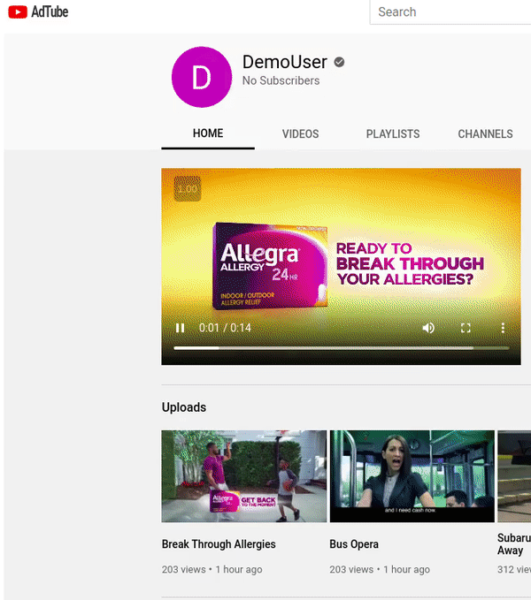
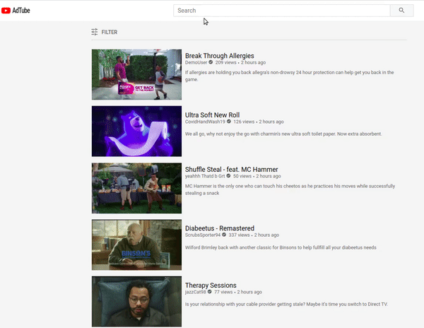
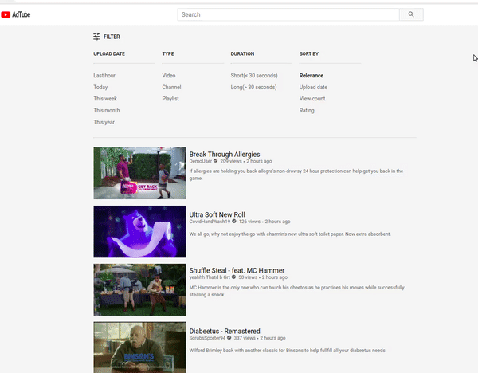
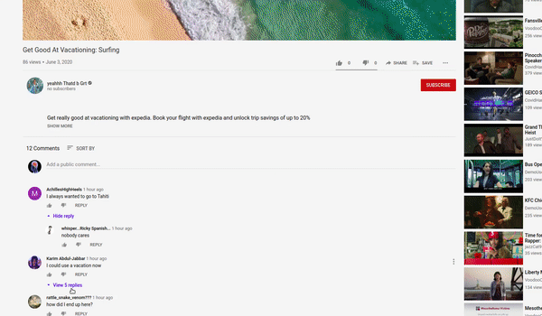

# **Adtube**

View all the ads you want here: [AdTube live!](https://adtube1.herokuapp.com/#/)

AdTube is a YouTube clone and video-sharing platform where users can browse for videos or create an account and upload and edit or delete their own
videos and comments. Users can also like videos and comments as well as search and implement their own custom filter for videos.

## **Technologies Used:**

* Ruby On Rails
* React/Redux
* PostgresSQL database
* jQuery
* Vanilla JavaScript
* Amazon Web Services (S3)
* Heroku

## **Features:**

* Create an account or login as a demo user
* Browse and stream videos.
* Upload your own videos along with a profile picture

* Search for videos

* Enhance your search with your own custom filter

* Interact with other users through comments

* Like your favorite videos

## **Possible Future Directions of the Project**

* optimize overall website performance
* add video search dropdown with recent searches
* allow users to create channels that other users can subscribe to
* allow users to create posts on their channel that other users can comment on and like
* add playlists and video queue
